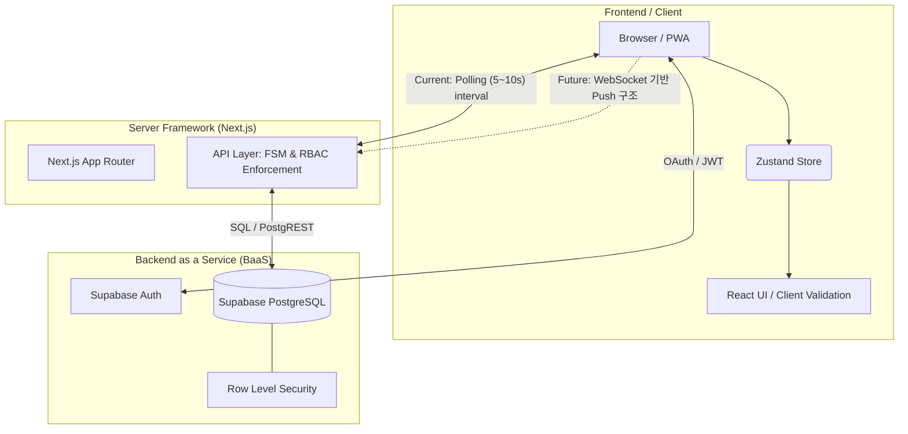
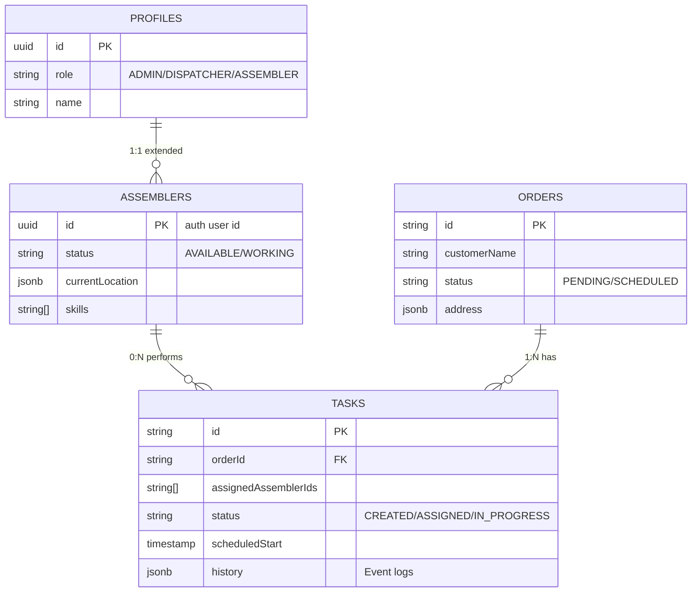

# IKEA Field Service – Architecture & Technical Overview

본 문서는 **IKEA Field Service (조립 및 배송 스케줄러 플랫폼)** 의 클라이언트 프리젠테이션 및 기술 인수인계를 위한 상세 아키텍처, 기술 스택, 시스템 구조 및 향후 발전 방향을 정리한 문서입니다.

---

## 1. Executive Summary (서비스 개요)

IKEA Field Service 플랫폼은 IKEA 가구 조립 및 배송을 담당하는 작업자(Assembler)들과 관리자(Dispatcher/Admin) 간의 원활한 업무 할당, 스케줄링 및 실시간 상태 추적을 돕기 위해 구축된 **지능형 현장 업무 관리 시스템(FSM: Field Service Management)** 입니다. 

- **실시간 데이터 동기화**: 관리자가 작업을 할당하면 작업자 화면에 즉시 반영됩니다.
- **지도 기반 라우팅**: 지도 인터페이스 위에서 작업자의 현재 위치와 작업 현장을 한눈에 파악합니다.
- **반응형 Web App**: 데스크탑 PWA 및 모바일 웹 환경을 모두 완벽하게 지원합니다.

---

## 2. Example Flow (핵심 업무 수행 흐름)

서비스의 주 사용자인 관리자(Dispatcher)와 현장 작업자(Assembler)는 다음과 같은 유기적인 흐름으로 상호작용합니다.

### 🏢 [Dispatcher Flow] (관리자)
1. **주문/작업 생성**: 시스템에 접수된 조립 및 배송 오더를 확인합니다.
2. **사전 평가 및 지도 확인**: 대시보드 지도 위에서 작업자들의 실시간 위치와 스케줄을 파악합니다.
3. **작업 할당 (`ASSIGNED`)**: 거리와 스킬셋이 적합한 작업자에게 작업을 배정합니다.
4. **진행 상태 모니터링**: 작업자의 이동 및 작업 완료 여부를 실시간으로 추적 및 관리합니다.

### 👷 [Assembler Flow] (현장 작업자)
1. **작업 수신**: 모바일 디바이스(PWA)를 통해 새롭게 배정된 업무를 수신합니다.
2. **이동 시작 (`EN_ROUTE`)**: 할당된 작업 확인 후, 현장으로 출발 상태를 보고합니다.
3. **작업 시작 (`WORKING`)**: 고객 거점에 도착하여 본격적인 조립 업무에 착수합니다.
4. **작업 완료 (`COMPLETED`)**: 조립을 성공적으로 마치고 결과를 시스템에 등록합니다.

---

## 3. System Architecture (시스템 아키텍처)

본 플랫폼은 **서버리스(Serverless)** 및 **BaaS (Backend as a Service)** 형태의 아키텍처를 채택하여 인프라 관리 부담을 최소화하고 높은 보안과 확장성을 보장합니다.



### 🎯 상태 관리 및 통제 모델 핵심 요약

> [!IMPORTANT]
> **API Layer 역할 강화**
> 모든 상태 변경은 API Layer에서 FSM 검증과 Role 기반 권한 검증(RBAC)을 거쳐 수행됩니다.

* **Finite State Machine (FSM) 상태 전이**
  ```text
  AVAILABLE → ASSIGNED → EN_ROUTE → WORKING → COMPLETED
                                        ↘
                                        ISSUE
  ```
  **모든 상태 전이는 FSM 기반으로 서버(API)에서 엄격하게 검증되며, 클라이언트는 UI 레벨에서 사전 검증을 통해 유저 에러를 차단합니다.**
  
* **Database 보안 강제화 (RLS)**
  Supabase **Row Level Security (RLS)** 정책을 활용하여,
  **Dispatcher는 전체 데이터 조회 가능**, **Assembler는 본인 작업만 조회 가능**하도록 구현되었습니다. 이는 로직 누락에 의한 보안 사고를 원천 차단하는 DB 레벨에서 강제되는 보안 모델입니다.

---

## 4. Technology Stack (전체 기술 스택)

| 분류 | 기술명 | 사용 목적 및 장점 |
| :--- | :--- | :--- |
| **Framework** | **Next.js 15** | App Router 기반의 SSR, 무중단 라우팅, 강력한 API Route 스캐폴딩 |
| **Language** | **TypeScript** | 강타입 언어로서 런타임 오류 방지 및 높은 코드 유지보수성 |
| **Database/Auth**| **Supabase** | RLS 및 인증 시스템, PostgreSQL 데이터베이스가 결합된 서버리스 DB |
| **State Management**| **Zustand** | 가볍고 직관적인 상태 관리, Current: Polling(5~10s interval) 아키텍처 지원 |
| **Styling & UI** | **Tailwind CSS / shadcn/ui** | 유틸리티 퍼스트 디자인 기반 프리미엄 반응형 UI 구성 |
| **Map Engine** | **Leaflet** | 클라이언트 영역에서의 지도, 마커 렌더링 및 클러스터링 |

---

## 5. Directory Structure (핵심 디렉토리 구조)

프로젝트는 기능 최적화와 결합도를 낮추기 위해 `app` 기반 라우트 그룹핑을 사용합니다.

```text
ikea-scheduler-platform/
├── src/
│   ├── app/
│   │   ├── (dashboard)/        # 로그인 이후 접근 가능한 대시보드 화면 그룹
│   │   │   ├── assemblers/     # 작업자(Assembler) 계정 관리 및 상태 변경 
│   │   │   ├── map/            # 지도 실시간 관제 센터
│   │   │   ├── schedule/       # 주간/월간 캘린더 관리 뷰
│   │   │   ├── status/         # 작업별 세부 상태 관리(FSM) 보드
│   │   │   └── page.tsx        # 대시보드 메인 홈
│   │   ├── api/                # 상태 변경, 인증 등 Backend 로직 (RBAC & FSM Enforcement)
│   │   └── login/              # 퍼블릭 로그인 페이지
│   │
│   ├── components/             # 재사용 UI 블록 및 도메인 기능 모듈
│   ├── lib/                    # 데이터 통신 프로토콜, FSM 스펙, Typescript 타입
│   ├── hooks/                  # 인증 및 기타 커스텀 React Hooks (`useAuth`)
│   └── middleware.ts           # Route Protection 미들웨어
│
└── supabase/
    └── schema.sql              # Supabase DB 초기화 및 RLS, 프로시저 구조
```

---

## 6. Database Schema (데이터베이스 구조)



---

## 7. 향후 발전 방향 (Roadmap)

시스템의 유연성과 서비스 품질을 단계적으로 업그레이드 하기 위해, 우선순위에 기반한 **3단계 마일스톤(Phases)** 을 제안합니다.

### 🚀 Phase 1 (단기 고도화)
* **Realtime Tracking (웹소켓 기반 푸시 구조)**
  * **Current:** Polling (5~10초 주기) 폴링 방식
  * **Future:** Supabase Realtime(WebSocket) 기능을 적용하여 API Request 부하를 극도로 낮추고, 데이터 변경 즉시 클라이언트로 이벤트(Push) 브로드캐스팅
* **Notification System**
  * 작업 할당 및 고객 배송 출발 시 SMS / 카카오 알림톡 자동 발송 처리
  * 인앱(PWA) 푸시 알림 도구 접목

### ⚡ Phase 2 (중기 고도화)
* **AI Routing & Auto Scheduling**
  * 휴리스틱(수동) 배차에서 벗어나, 교통 상황(Google Delivery Matrix) 및 작업자 보유 스킬, 누적 작업 피로도 기반 최적 결로 자동 배차 제안 체계 구축
* **Customer Portal (고객 자가 관리 페이지)**
  * 방문 서비스 이전에 고객이 직접 예약 시간을 튜닝하고, 작업 완료 후 실시간 서비스 피드백(평점 등)을 남겨 Assembler Rating에 직결되게 하는 외부 포털 제공

### 🌐 Phase 3 (장기 고도화)
* **Native Mobile App (Capacitor / React Native)**
  * 오프라인 전원 관리 혜택 및 백그라운드 상시 로케이션 업데이트 기능을 얻기 위해 PWA 기술에서 App Store 지향형 네이티브 앱 구조로 포장
* **Offline-First Sync (데이터 캐싱 동기화)**
  * 통신 장애가 발생하는 특수구역(아파트 신축 단지 지하 주차장 등)에서 작업자가 FSM 상태(`WORKING`, `ISSUE`) 변경을 발생시킬 경우 IndexedDB/SQLite 에 캐싱했다가 네트워크가 복구되면 서버로 레이지 싱크(Lazy Sync) 처리하는 오프라인 오퍼레이션 보강
