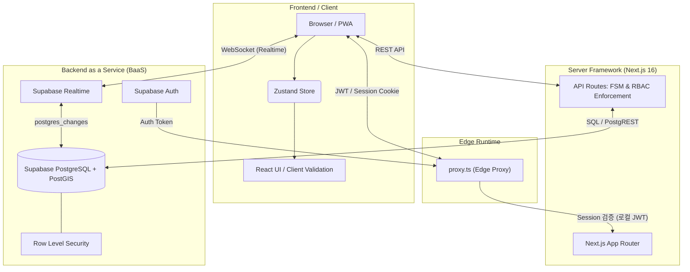
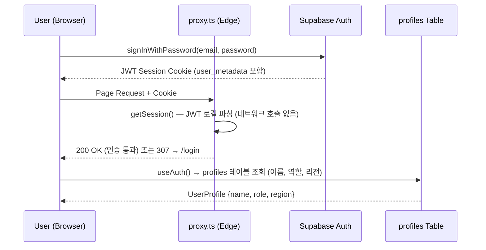

# IKEA Field Service – Architecture & Technical Overview

본 문서는 **IKEA Field Service (조립 및 배송 스케줄러 플랫폼)** 의 클라이언트 프리젠테이션 및 기술 인수인계를 위한 상세 아키텍처, 기술 스택, 시스템 구조 및 향후 발전 방향을 정리한 문서입니다.

---

## 1. Executive Summary (서비스 개요)

IKEA Field Service 플랫폼은 IKEA 가구 조립 및 배송을 담당하는 작업자(Assembler)들과 관리자(Dispatcher/Admin) 간의 원활한 업무 할당, 스케줄링 및 실시간 상태 추적을 돕기 위해 구축된 **지능형 현장 업무 관리 시스템(FSM: Field Service Management)** 입니다. 

- **실시간 데이터 동기화**: Supabase Realtime(WebSocket)을 통해 작업 상태 변경이 모든 클라이언트에 즉시 반영됩니다.
- **지도 기반 라우팅**: Leaflet 지도 인터페이스 위에서 작업자의 현재 위치와 작업 현장을 한눈에 파악합니다.
- **반응형 Web App**: 데스크탑 PWA 및 모바일 웹 환경을 모두 완벽하게 지원합니다.
- **역할 기반 접근 제어(RBAC)**: Admin, Dispatcher, Assembler 역할별 차별화된 화면과 권한을 제공합니다.

---

## 2. Example Flow (핵심 업무 수행 흐름)

서비스의 주 사용자인 관리자(Dispatcher)와 현장 작업자(Assembler)는 다음과 같은 유기적인 흐름으로 상호작용합니다.

### 🏢 [Dispatcher Flow] (관리자)
1. **주문/작업 생성**: 시스템에 접수된 조립 및 배송 오더를 확인합니다.
2. **사전 평가 및 지도 확인**: 대시보드 지도 위에서 작업자들의 실시간 위치와 스케줄을 파악합니다.
3. **작업 할당 (`ASSIGNED`)**: 거리와 스킬셋이 적합한 작업자에게 작업을 배정합니다.
4. **진행 상태 모니터링**: 작업자의 이동 및 작업 완료 여부를 실시간으로 추적 및 관리합니다.

### 👷 [Assembler Flow] (현장 작업자)
1. **작업 수신**: 모바일 디바이스(PWA)를 통해 새롭게 배정된 업무를 수신합니다.
2. **이동 시작 (`EN_ROUTE`)**: 할당된 작업 확인 후, 현장으로 출발 상태를 보고합니다.
3. **작업 시작 (`IN_PROGRESS`)**: 고객 거점에 도착하여 본격적인 조립 업무에 착수합니다.
4. **작업 완료 (`COMPLETED`)**: 조립을 성공적으로 마치고 결과를 시스템에 등록합니다.
5. **검수 완료 (`VERIFIED`)**: Admin이 최종 확인 후 검수를 완료합니다.

---

## 3. System Architecture (시스템 아키텍처)

본 플랫폼은 **서버리스(Serverless)** 및 **BaaS (Backend as a Service)** 형태의 아키텍처를 채택하여 인프라 관리 부담을 최소화하고 높은 보안과 확장성을 보장합니다.



### 🎯 Edge Proxy 최적화

> [!IMPORTANT]
> **Zero-Network-Call Proxy**
> `proxy.ts`는 Supabase 서버에 네트워크 요청 없이 JWT 쿠키를 로컬 파싱하여 인증/인가를 수행합니다.

| 항목 | 이전 방식 | 현재 방식 |
| :--- | :--- | :--- |
| **인증 확인** | `getUser()` — Supabase Auth 서버 호출 (~200-500ms) | `getSession()` — JWT 쿠키 로컬 파싱 (~1ms) |
| **역할 확인** | `profiles` 테이블 DB 쿼리 (~200ms) | `user_metadata.role` JWT에서 추출 (~0ms) |
| **API 라우트** | Proxy를 거쳐 불필요한 지연 발생 | matcher에서 제외하여 직접 실행 |
| **총 오버헤드** | **~400-1000ms / 요청** | **~1-5ms / 요청** |

### 🛡️ Hydration 안정성 (suppressHydrationWarning)

> [!NOTE]
> **브라우저 확장 프로그램 대응**
> `layout.tsx`의 `<html>` 및 `<body>` 태그에 `suppressHydrationWarning` 속성을 적용하여, 브라우저 확장 프로그램(예: Jetski, Grammarly 등)이 DOM에 주입하는 속성(`data-*` 등)으로 인한 React Hydration Mismatch 경고를 방지합니다.

- **적용 범위**: `<html>`, `<body>` 태그에만 한정 (1-depth only)
- **동작 원리**: React가 서버 렌더링 HTML과 클라이언트 DOM 비교 시, 해당 태그의 속성 차이를 무시
- **안전성**: 자식 요소의 hydration 검증에는 영향을 주지 않으므로 실제 코드 버그는 정상적으로 감지됨
- **참고**: Next.js 공식 권장 패턴 ([React Hydration Error](https://nextjs.org/docs/messages/react-hydration-error))

### 🎯 상태 관리 및 통제 모델 핵심 요약

* **Finite State Machine (FSM) 상태 전이**
  ```text
  CREATED → SCHEDULING → ASSIGNED → CONFIRMED → EN_ROUTE → ARRIVED → IN_PROGRESS → COMPLETED → VERIFIED
                                                                          ↘
                                                                         ISSUE
                                                        (any) → CANCELLED
  ```
  **모든 상태 전이는 FSM 기반으로 서버(API)에서 엄격하게 검증됩니다.**
  - Admin/Dispatcher: 모든 상태 전이 가능 (강제 취소, 검수 포함)
  - Assembler: `CONFIRMED → EN_ROUTE → ARRIVED → IN_PROGRESS → COMPLETED` 본인 작업 흐름만 가능
  - 클라이언트는 UI 레벨에서 FSM에 따라 가능한 액션만 표시하여 사전 검증

* **실시간 데이터 동기화 (Supabase Realtime)**
  ```
  DB 변경 → postgres_changes → WebSocket → Zustand Store → UI 자동 반영
  ```
  `tasks`, `assemblers`, `orders` 테이블의 INSERT/UPDATE/DELETE 이벤트를 구독하여 모든 클라이언트에 즉시 반영됩니다.
  
* **Database 보안 강제화 (RLS)**
  Supabase **Row Level Security (RLS)** 정책을 활용하여,
  **Dispatcher는 전체 데이터 조회 가능**, **Assembler는 본인 작업만 조회 가능**하도록 구현되었습니다.

---

## 4. Technology Stack (전체 기술 스택)

| 분류 | 기술명 | 사용 목적 및 장점 |
| :--- | :--- | :--- |
| **Framework** | **Next.js 16.1.2** | App Router, Turbopack, Edge Proxy(`proxy.ts`) 기반 고성능 풀스택 프레임워크 |
| **Language** | **TypeScript** | 강타입 언어로서 런타임 오류 방지 및 높은 코드 유지보수성 |
| **Database/Auth**| **Supabase** | PostgreSQL + PostGIS + Auth + Realtime이 결합된 서버리스 BaaS |
| **State Management**| **Zustand** | 가볍고 직관적인 상태 관리, Optimistic UI 패턴, Realtime 구독 통합 |
| **Styling & UI** | **Tailwind CSS v4 / shadcn/ui / Radix UI** | 유틸리티 퍼스트 디자인 + 접근성 기반 프리미엄 반응형 UI |
| **Map Engine** | **Leaflet + react-leaflet** | 클라이언트 영역에서의 지도, 마커 렌더링 및 GeoJSON 연동 |
| **Deployment** | **Vercel** | Edge Runtime, 자동 배포, 글로벌 CDN |

---

## 5. Directory Structure (핵심 디렉토리 구조)

프로젝트는 기능 최적화와 결합도를 낮추기 위해 `app` 기반 라우트 그룹핑을 사용합니다.

```text
ikea-scheduler-platform/
├── src/
│   ├── app/
│   │   ├── (dashboard)/        # 로그인 이후 접근 가능한 대시보드 화면 그룹
│   │   │   ├── assemblers/     # 작업자(Assembler) CRUD 관리 (추가/수정/비활성화)
│   │   │   ├── fsm-demo/       # FSM 상태 전이 데모 페이지
│   │   │   ├── map/            # 지도 실시간 관제 센터 (Leaflet)
│   │   │   ├── orders/         # 주문 관리 및 생성
│   │   │   ├── schedule/       # Operations Center (3-Panel: Queue + Map + Assemblers)
│   │   │   ├── settings/       # 시스템 설정 (Admin 전용)
│   │   │   ├── status/         # Job Status — 역할별 분기 (Admin: 전체관리 / Assembler: My Jobs)
│   │   │   ├── layout.tsx      # DashboardLayout (Sidebar + MobileNav 래퍼)
│   │   │   └── page.tsx        # 대시보드 메인 홈 (Task List + Map 이중 패널)
│   │   ├── layout.tsx          # RootLayout (suppressHydrationWarning 적용 — 확장 프로그램 대응)
│   │   ├── api/                # Backend API 로직
│   │   │   ├── admin/          #   └─ link-assembler: 프로필 연동
│   │   │   ├── assemblers/     #   └─ GET/POST + [id]/PUT/DELETE (CRUD)
│   │   │   ├── orders/         #   └─ GET/POST + [id]/PUT/DELETE + create
│   │   │   └── tasks/          #   └─ GET + [taskId]/status (FSM 전이) + assign
│   │   └── login/              # 퍼블릭 로그인 페이지 (데모 계정 포함)
│   │
│   ├── components/
│   │   ├── features/           # 도메인 기능 모듈
│   │   │   ├── AssemblerFormModal.tsx   # Assembler 추가/수정 모달
│   │   │   ├── AssignmentModal.tsx      # Assembler-Task 할당 모달 (추천 점수 포함)
│   │   │   ├── CreateOrderModal.tsx     # 주문 생성 모달
│   │   │   ├── DashboardLayout.tsx      # Sidebar + Main + MobileNav 레이아웃
│   │   │   ├── MapComponent.tsx         # Leaflet 지도 (동적 import, SSR 비활성화)
│   │   │   ├── MobileNav.tsx            # 모바일 하단 내비게이션 바
│   │   │   ├── Sidebar.tsx              # 데스크탑 사이드바 (역할별 메뉴 필터링)
│   │   │   └── TaskList.tsx             # 대시보드 작업 목록
│   │   ├── fsm/                # FSM 관련 UI 컴포넌트
│   │   ├── ui/                 # shadcn/ui 기반 공통 UI 원자 컴포넌트
│   │   ├── DataInitializer.tsx # 앱 시작 시 데이터 로드 + Realtime 구독 초기화
│   │   └── Toaster.tsx         # 전역 토스트 알림 시스템
│   │
│   ├── hooks/
│   │   └── useAuth.ts          # Supabase Auth 세션 + profiles 테이블 연동 Hook
│   │
│   ├── lib/
│   │   ├── supabase/           # Supabase 클라이언트 팩토리
│   │   │   ├── client.ts       #   └─ 브라우저용 (createBrowserClient)
│   │   │   ├── middleware.ts   #   └─ Edge Proxy용 (createServerClient)
│   │   │   └── server.ts       #   └─ API Route/Server Component용 (createServerClient)
│   │   ├── task-fsm.ts         # Task FSM 상태 전이 검증 엔진
│   │   ├── task-fsm-config.ts  # FSM 전이 규칙 + UI 액션 레이블/색상 정의
│   │   ├── assembler-fsm.ts    # Assembler FSM 상태 관리
│   │   ├── fsm-config.ts       # Assembler FSM 전이 규칙
│   │   ├── store.ts            # Zustand 전역 스토어 (CRUD + Realtime + Optimistic UI)
│   │   ├── scheduler.ts        # 휴리스틱 기반 작업자 추천 로직
│   │   ├── types.ts            # 전역 TypeScript 타입 정의
│   │   ├── utils.ts            # NZ 타임존 포맷 유틸리티
│   │   └── mockData.ts         # 개발/Seed용 목업 데이터
│   │
│   └── proxy.ts                # Edge Proxy — 인증 + RBAC (Next.js 16 proxy convention)
│
└── supabase/
    ├── schema.sql              # DB 스키마 (users, assemblers, orders, tasks, task_assignments, task_events)
    ├── functions.sql           # PostGIS 변환 함수 + assign_task_to_assemblers RPC
    └── seed.ts                 # 개발용 DB 초기 데이터 시딩 스크립트
```

---

## 6. Database Schema (데이터베이스 구조)

```mermaid
erDiagram
    USERS ||--o| PROFILES : "1:1 (Auth 연동)"
    USERS {
        uuid id PK "Supabase Auth UUID"
        string email UK
        string role "ADMIN | DISPATCHER | ASSEMBLER"
        boolean is_active
    }

    PROFILES {
        uuid id PK "Auth UUID"
        string email
        string name
        string role "ADMIN | DISPATCHER | ASSEMBLER"
        string region
        string assembler_id FK
    }

    PROFILES ||--o| ASSEMBLERS : "1:1 extended"
    ASSEMBLERS {
        uuid user_id PK "FK users.id"
        string name
        string phone_primary
        float rating "1-5"
        geography current_location "PostGIS Point"
        uuid active_task_uuid FK
        string status "AVAILABLE | BUSY | OFFLINE"
    }

    ASSEMBLERS ||--o{ ASSEMBLER_SKILLS : "1:N"
    ASSEMBLER_SKILLS {
        uuid assembler_id PK_FK
        string skill PK "EASY | MEDIUM | HARD"
    }

    ASSEMBLERS ||--o{ TASK_ASSIGNMENTS : "M:N"
    TASKS ||--o{ TASK_ASSIGNMENTS : "M:N"
    TASK_ASSIGNMENTS {
        uuid task_uuid PK_FK
        uuid assembler_id PK_FK
    }

    ORDERS ||--o{ TASKS : "1:N has"
    ORDERS {
        string id PK
        uuid uuid UK
        string customer_name
        string customer_phone
        timestamp delivery_date
        geography location "PostGIS Point"
        jsonb items
        string status "PENDING | CONFIRMED | DELIVERED | CANCELLED"
    }

    TASKS ||--o{ TASK_EVENTS : "1:N logs"
    TASKS {
        string id PK
        uuid uuid UK
        string order_id FK
        string skill_required "EASY | MEDIUM | HARD"
        string status "FSM 상태"
        timestamp scheduled_start
        timestamp scheduled_end
        int estimated_duration_minutes
    }

    TASK_EVENTS {
        string id PK
        string task_id FK
        string event_type
        timestamp event_time
        geography location "PostGIS Point"
        jsonb metadata
    }
```

---

## 7. Authentication & Authorization (인증 및 인가)

### 인증 흐름



### 역할별 접근 권한

| 기능 | Admin | Dispatcher | Assembler |
| :--- | :---: | :---: | :---: |
| Dashboard | ✅ | ✅ | ✅ |
| Orders 관리 | ✅ | ✅ | ❌ |
| Schedule (Operations Center) | ✅ | ✅ | ❌ |
| Job Status (전체 보기) | ✅ | ✅ | — |
| My Jobs (본인 작업) | — | — | ✅ |
| Map View | ✅ | ✅ | ❌ |
| Assembler 관리 (CRUD) | ✅ | ✅ | ❌ |
| Settings | ✅ | ❌ | ❌ |

---

## 8. 향후 발전 방향 (Roadmap)

시스템의 유연성과 서비스 품질을 단계적으로 업그레이드 하기 위해, 우선순위에 기반한 **3단계 마일스톤(Phases)** 을 제안합니다.

### 🚀 Phase 1 (단기 고도화)
* **Notification System**
  * 작업 할당 및 고객 배송 출발 시 SMS / 카카오 알림톡 자동 발송 처리
  * 인앱(PWA) 푸시 알림 도구 접목
* **DB 스키마 정규화**
  * `profiles` 테이블과 `users` 테이블 통합 또는 View 기반 정리
  * `schema.sql`에 `profiles` 테이블 정의 추가

### ⚡ Phase 2 (중기 고도화)
* **AI Routing & Auto Scheduling**
  * 휴리스틱(수동) 배차에서 벗어나, 교통 상황(Google Delivery Matrix) 및 작업자 보유 스킬, 누적 작업 피로도 기반 최적 경로 자동 배차 제안 체계 구축
* **Customer Portal (고객 자가 관리 페이지)**
  * 방문 서비스 이전에 고객이 직접 예약 시간을 튜닝하고, 작업 완료 후 실시간 서비스 피드백(평점 등)을 남겨 Assembler Rating에 직결되게 하는 외부 포털 제공

### 🌐 Phase 3 (장기 고도화)
* **Native Mobile App (Capacitor / React Native)**
  * 오프라인 전원 관리 혜택 및 백그라운드 상시 로케이션 업데이트 기능을 얻기 위해 PWA 기술에서 App Store 지향형 네이티브 앱 구조로 포장
* **Offline-First Sync (데이터 캐싱 동기화)**
  * 통신 장애가 발생하는 특수구역(아파트 신축 단지 지하 주차장 등)에서 작업자가 FSM 상태(`IN_PROGRESS`, `ISSUE`) 변경을 발생시킬 경우 IndexedDB/SQLite 에 캐싱했다가 네트워크가 복구되면 서버로 레이지 싱크(Lazy Sync) 처리하는 오프라인 오퍼레이션 보강
